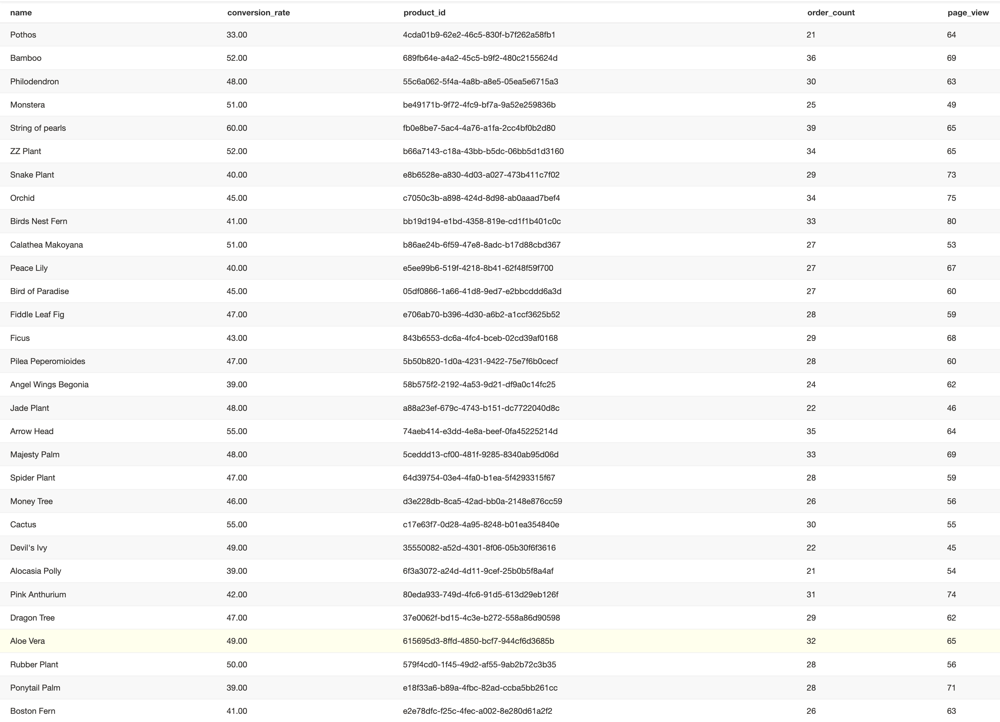

## Question 1: What is our overall conversation rate?

```SQL


WITH session_count AS
(
	SELECT  session_id
	       ,sum (case WHEN event_type='checkout' THEN 1 else 0 end) checkout_count
	FROM {{ ref ('fct_events') }}
	GROUP BY  session_id
)
SELECT  SUM(checkout_count)::numeric/COUNT(session_id)
FROM session_count

```
### Answer: 62.45

---

## Question 2: What is our conversion rate by product



### Answer:

### Macro 

```SQL


	SELECT  product_id
	       ,SUM(case WHEN event_type='{{ event_type }}' THEN 1 else 0 end)   AS {{ event_type }}
	FROM {{ ref ('fct_events') }}
	WHERE product_id is not null
	GROUP BY  1


```
### Macro usage

```SQL

WITH product_page_view AS
(
  {{ get_product_event_type_counts('page_view') }}
), 

order_count AS
(
	SELECT  product_id
	       ,COUNT(order_id) ocount
	FROM {{ ref ('fct_order_items') }}
	GROUP BY  1
), 

product_info AS
(
	SELECT  *
	FROM {{ ref ('dim_products') }}
)

SELECT  i.name
       ,ROUND(o.ocount::numeric/p.page_view,2)*100 AS conversion_rate
       ,o.product_id
       ,o.ocount as order_count
       ,p.page_view
FROM order_count o
JOIN product_page_view p
ON o.product_id=p.product_id
JOIN product_info i
ON i.product_id=o.product_id

```
---

